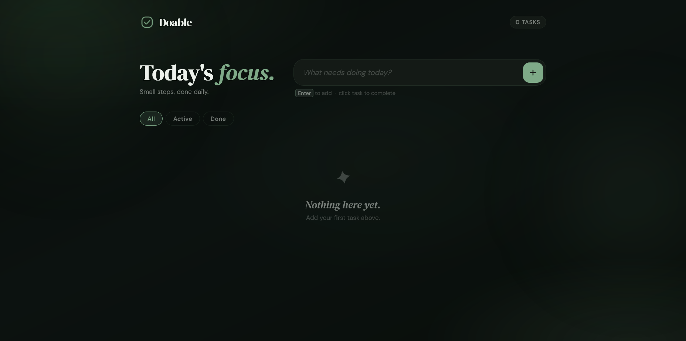
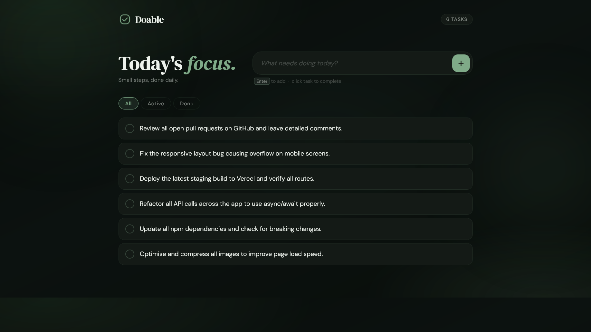
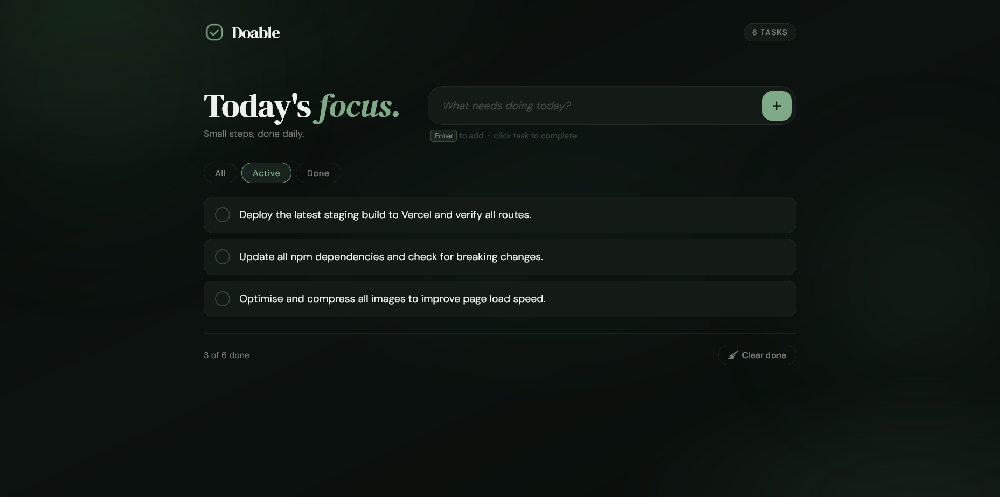
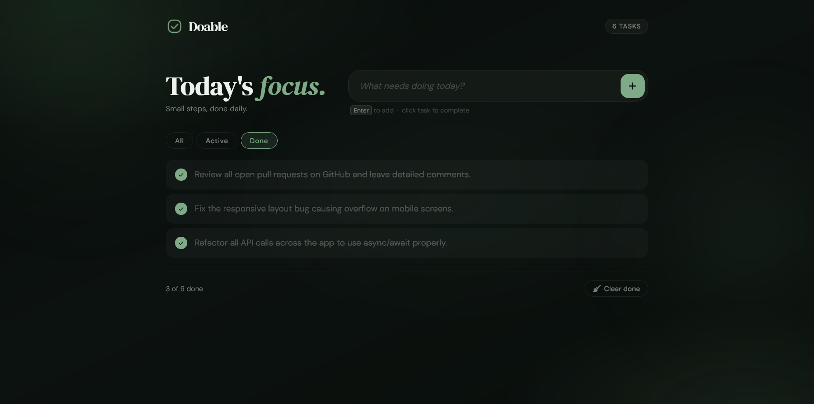

# 📝 Doable - To-Do Task List App

Doable is a clean and user-friendly To-Do Task Management application built using HTML, CSS, and JavaScript. It helps users stay organized by managing daily tasks efficiently.

---

## 🚀 Live Demo
🔗 https://monikamittal-1728.github.io/Doable/

---

## 💻 GitHub Repository
🔗 https://github.com/monikamittal-1728/Doable.git

---

## ✨ Features

- ➕ Add new tasks  
- ✅ Mark tasks as completed  
- ❌ Delete individual tasks using cross button  
- 🧹 Clear all completed tasks in one click  
- 🔢 Task counter to track total tasks  
- ⚡ Instant UI updates (real-time interaction)  
- 📱 Responsive and clean design  

---

## 📸 Screenshots

### 🟢 Empty State


### 🟡 Full Task List


### 🔵 Active Tasks


### 🟣 Completed Tasks


---

## 🛠️ Tech Stack

- HTML5  
- CSS3  
- JavaScript (Vanilla JS)

---

## ⚙️ How to Run Locally

1. Clone the repository:

```
git clone https://github.com/monikamittal-1728/Doable.git
```

2. Open the project folder

3. Run by opening:

```
index.html
```

---

## 📚 Key Learnings

- DOM Manipulation  
- Event Handling  
- Dynamic UI Updates  
- Managing task states (active/completed)  

---

## 👩‍💻 Author

**Monika Mittal**  
Aspiring Full Stack Developer  

---

## ⭐ Support

If you found this project helpful, please consider giving it a ⭐ on GitHub!
